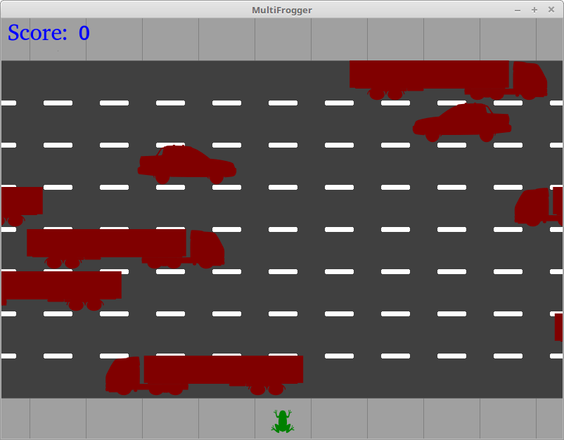

# MultiFrogger
By Jose Alberto Chaves.
### About
This project is a reboot of the classic 1981's arcade game [Frogger](https://en.wikipedia.org/wiki/Frogger) but with a new feature: Multiplayer playability.

Two players will be able to compete with each other, through a network connection, to be the player with the highest score.

### Game objective
Each player controls a frog trying to cross a road to reach to the other side of the screen. The road has a lot of lanes with moving vehicles that act as obstacles that will kill a player's frog upon contact. Successfully reaching to the other side of the screen will earn the player 1 point. Dying will result in re-spawning at the beginning of the screen after a few seconds of time penalty.

Use the arrow keys to control your frog.

### Network playability
To play with another person, you can connect with another computer through a client-server model; one computer hosts the game and the other joins it through a network socket.

Once connected, you can race each other to see who reachs the other side of the screen first. When one player gets to the goal, they will be awarded a point and the game resets for both of them with a slightly harder level. This process continues until one player disconnects.

### Screenshot
##### As of 24th of july, 2018

### To do
- Add:
 - Network implementation

- Fix:
 - Player movement animation

### Asset Attributions
Frog model by Tak Kenal Capek from the Noun Project
motorbike by lipi from the Noun Project
Car and truck models by [all-silhouettes.com](http://All-Silhouettes.com)  
Song "Monkeys Spinning Monkeys"
[Kevin MacLeod](incompetech.com)
Licensed under [Creative Commons: By Attribution 3.0](http://creativecommons.org/licenses/by/3.0/)
"MultiFrogger" text logo created in [FlamingText](http://flamingtext.com)
